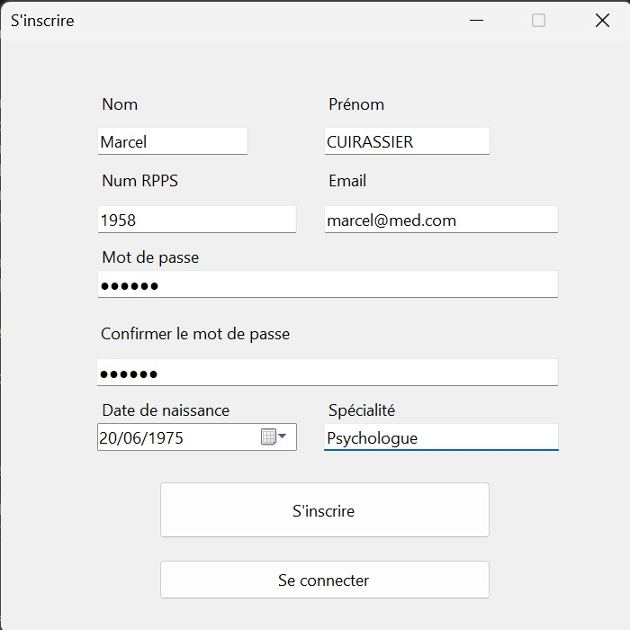
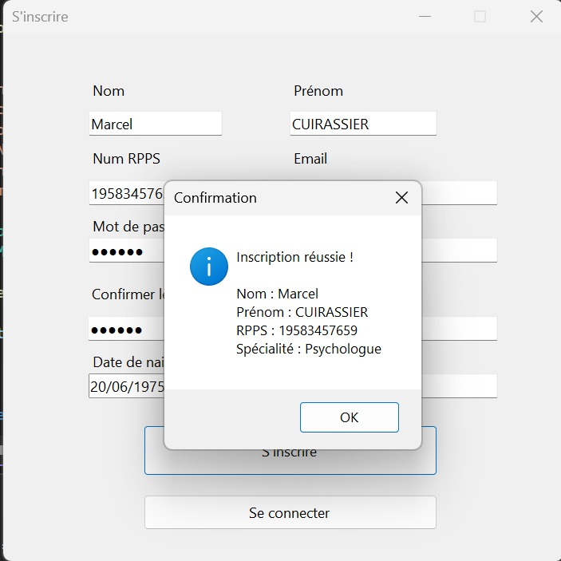
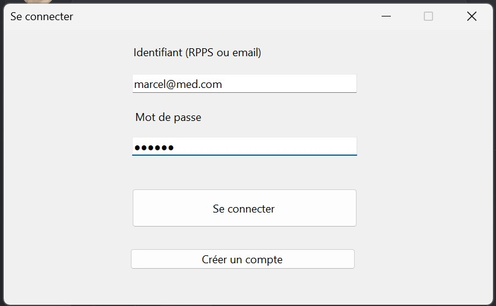
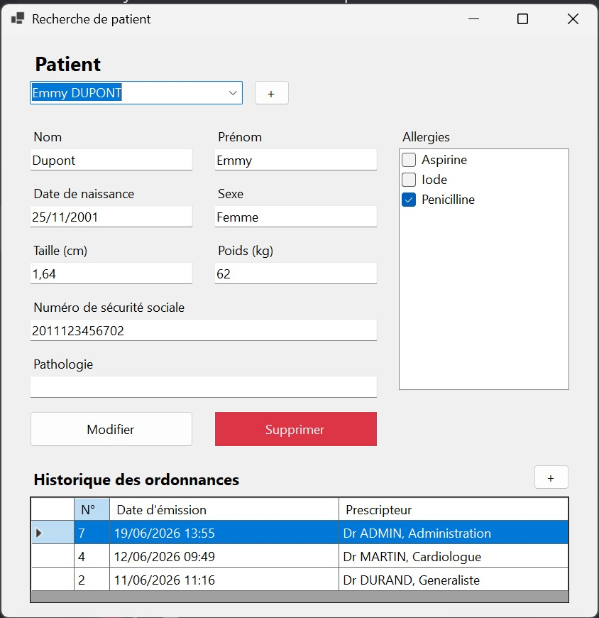
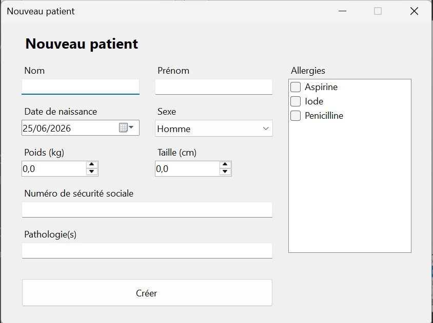
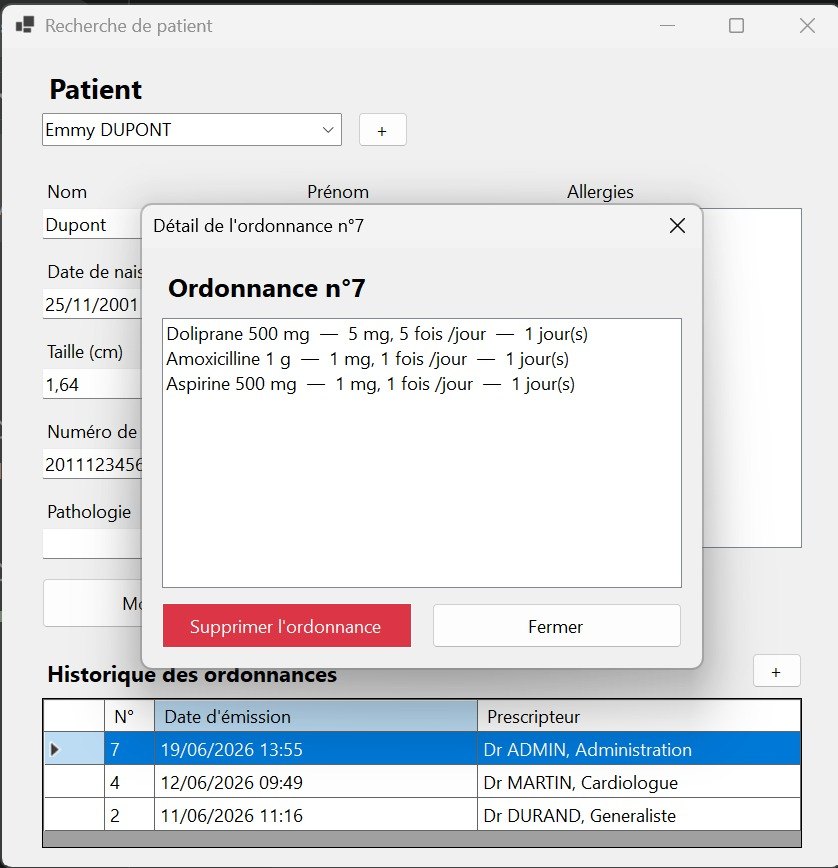
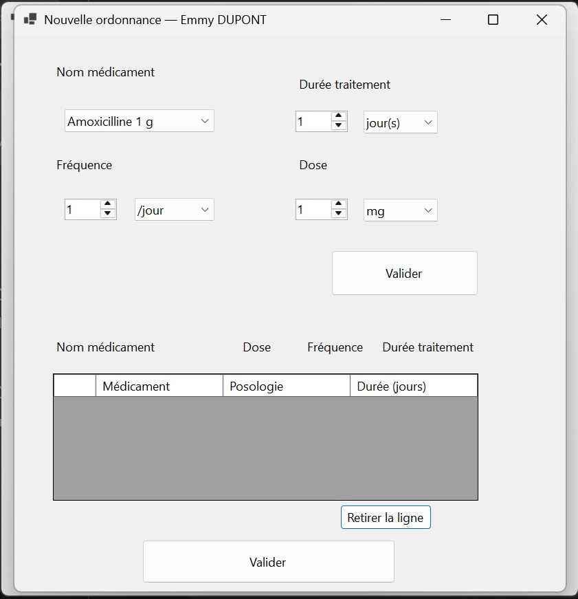

# Documentation technique — GSB Ordonnances

Cette documentation décrit **l'intégralité du fonctionnement** de l'application GSB
Ordonnances : son architecture, le modèle **MVC** (expliqué en détail), puis
**chaque fichier de chaque catégorie** avec ses **méthodes les plus importantes**.

Elle est destinée à comprendre le projet sans avoir à lire tout le code, et à pouvoir
le présenter (oral E6 / écrit E7 du BTS SIO SLAM).

---

## Table des matières

1. [Présentation générale](#1-présentation-générale)
2. [L'architecture MVC en détail](#2-larchitecture-mvc-en-détail)
3. [Arborescence du projet](#3-arborescence-du-projet)
4. [La couche d'accès aux données (`DataAcces/`)](#4-la-couche-daccès-aux-données-dataacces)
5. [Les modèles (`Models/`)](#5-les-modèles-models)
6. [Les contrôleurs (`Controllers/`)](#6-les-contrôleurs-controllers)
7. [Les vues (`Vue/`)](#7-les-vues-vue)
8. [Les fichiers racine (`Program.cs`, `Session.cs`)](#8-les-fichiers-racine)
9. [Sécurité](#9-sécurité)
10. [Les trois patterns d'accès aux données à retenir](#10-les-trois-patterns-daccès-aux-données-à-retenir)
11. [La base de données](#11-la-base-de-données)
12. [Manuel d'utilisation (captures d'écran)](#12-manuel-dutilisation-captures-décran)

---

## 1. Présentation générale

GSB Ordonnances est une application de bureau **Windows Forms (WinForms)** permettant à
un **médecin** de se connecter, de gérer des **patients** et de leur rédiger des
**ordonnances** (un médecin + un patient + une ou plusieurs lignes de médicaments).

### Technologies

| Élément | Détail |
|---|---|
| Langage / Framework | C# sur **.NET 8** (`net8.0-windows`) |
| Interface | **Windows Forms** (`UseWindowsForms`) |
| Base de données | **MySQL 8** (conteneur Docker), base `gsb_ordonnances` |
| Accès BDD | Paquet NuGet **MySql.Data** |
| Sécurité mots de passe | Paquet NuGet **BCrypt.Net-Next** (hachage bcrypt) |
| Architecture | **MVC** (Model – View – Controller) |

### Parcours utilisateur complet

```
┌─────────────┐   connexion (RPPS ou email + mot de passe)
│  Connexion  │───────────────────────────────────────────────┐
└─────┬───────┘                                                │
      │ « Créer un compte »                                    ▼
      ▼                                            ┌────────────────────────┐
┌─────────────┐   inscription d'un médecin        │   Recherche_patient    │  ← écran principal
│   Sign_up   │──────────────────────────────────▶│  (liste + fiche + hist.)│
└─────────────┘                                    └───┬───────────┬────────┘
                                                       │           │
                  « + » patient                        │           │  « + » ordonnance
                  ┌────────────────────┐               │           │  ┌──────────────────────┐
                  │  Création_patient  │◀──────────────┘           └─▶│   Créateur_d_ordo     │
                  └────────────────────┘  (modale)        (modale)    └──────────────────────┘
                                                       │
                  double-clic sur une ordonnance       │
                  ┌────────────────────────┐           │
                  │  OrdonnanceDetailForm   │◀──────────┘
                  │  (détail + supprimer)   │
                  └────────────────────────┘
```

1. **Connexion** : le médecin saisit son identifiant (**numéro RPPS ou email**) et son
   mot de passe. En cas de succès, il est mémorisé pour la session.
2. **Recherche_patient** (écran principal) : il choisit/recherche un patient, consulte
   et modifie sa fiche (avec ses **allergies**), voit l'**historique de ses ordonnances**.
3. Il peut **créer un patient**, **modifier**/**supprimer** le patient sélectionné,
   **créer une ordonnance**, ou **consulter/supprimer** une ordonnance existante.

---

## 2. L'architecture MVC en détail

### 2.1 Qu'est-ce que MVC ?

**MVC** signifie **Model – View – Controller** (Modèle – Vue – Contrôleur). C'est un
**patron d'architecture** (design pattern d'organisation) qui consiste à **séparer une
application en trois responsabilités distinctes**, pour que chaque partie ait un rôle
clair et puisse évoluer indépendamment des autres.

L'idée centrale est la **séparation des préoccupations** (*separation of concerns*) :

| Couche | Responsabilité | Réponse à la question… | Dans GSB |
|---|---|---|---|
| **Model** (Modèle) | Représenter les **données** et les **règles métier** | *« Quelles sont les données et que valent-elles ? »* | `Models/` (+ accès via `Controllers/` et `DataAcces/`) |
| **View** (Vue) | **Afficher** l'information et capter les **actions** de l'utilisateur | *« Comment l'utilisateur voit et interagit ? »* | `Vue/` (les formulaires WinForms) |
| **Controller** (Contrôleur) | Faire le **lien** : recevoir les demandes, manipuler le modèle, renvoyer le résultat | *« Que faire quand l'utilisateur agit ? »* | `Controllers/` |

### 2.2 Le rôle précis de chaque couche

**Le Modèle (Model)** — c'est le **cœur métier**, indépendant de l'interface.
Il contient :
- les **classes métier** (`Patient`, `Doctor`, `Ordonnance`…) qui décrivent *ce qu'est*
  un patient, un médecin, une ordonnance, avec leurs **propriétés** et leur
  **comportement** (ex. `Patient.EstMajeur()`, `Ordonnance.AjouterLigne()`) ;
- il ne sait **rien** de l'affichage : on pourrait remplacer WinForms par un site web
  sans toucher aux modèles.

**La Vue (View)** — c'est **tout ce que l'utilisateur voit** : les fenêtres, les
boutons, les champs de saisie, les grilles. Son rôle est double :
- **présenter** les données que le contrôleur lui fournit ;
- **transmettre** les actions de l'utilisateur (clic, double-clic, frappe) au contrôleur.
La vue ne contient **pas** de requête SQL ni de règle métier : elle délègue.

**Le Contrôleur (Controller)** — c'est l'**intermédiaire**. Quand l'utilisateur agit
dans la vue, celle-ci appelle une méthode du contrôleur. Le contrôleur :
- **lit ou écrit** dans la base (via la couche d'accès aux données) ;
- **transforme** les lignes SQL en objets du modèle (et inversement) — c'est le
  **mapping** ;
- **renvoie** le résultat à la vue, qui l'affiche.

### 2.3 Comment MVC est concrètement appliqué dans GSB

Le projet matérialise les trois couches par **trois dossiers**, plus une couche
technique d'accès aux données :

```
Models/        → le MODÈLE   (classes métier : Patient, Doctor, Ordonnance, …)
Vue/           → la VUE      (formulaires WinForms : Connexion, Recherche_patient, …)
Controllers/   → le CONTRÔLEUR (PatientController, OrdonnanceController, …)
DataAcces/     → couche d'accès aux données (DbConnexion : ouvre la connexion MySQL)
```

> **Nuance importante à connaître pour l'oral.** En WinForms « pur », la Vue contient
> aussi le code des **gestionnaires d'événements** (`btnRechercher_Click`…). Ces
> handlers font partie de la Vue, mais ils restent **fins** : ils se contentent de lire
> les champs de l'écran, d'appeler **une méthode du contrôleur**, puis d'afficher le
> retour. **Toute la logique de données est dans les contrôleurs**, jamais dans les
> formulaires. C'est ce qui rend l'architecture « MVC » et non du code « tout-en-un ».

### 2.4 Le flux d'une action, étape par étape

Exemple concret : **l'utilisateur recherche les patients dont le nom commence par « Dup »**.

```
1. VUE          L'utilisateur tape « Dup » et clique sur « Rechercher ».
   (PatientListForm / Recherche_patient)
                        │  appelle
                        ▼
2. CONTRÔLEUR   PatientController.ObtenirPatientsParNom("Dup")
                        │  ouvre une connexion (DataAcces)
                        ▼
3. ACCÈS BDD    DbConnexion.Ouvrir()  →  connexion MySQL ouverte
                        │  exécute une requête PARAMÉTRÉE
                        ▼
4. BASE         SELECT … FROM PATIENT WHERE nom LIKE @motCle
                        │  renvoie des lignes
                        ▼
5. CONTRÔLEUR   mapping : chaque ligne → un objet Patient (MODÈLE)
                        │  retourne List<Patient>
                        ▼
6. VUE          Affiche la liste des patients dans la grille / la combo.
```

À aucun moment la Vue ne « parle » directement à la base, et à aucun moment le
Contrôleur ne manipule des boutons. **Chacun reste dans son rôle.**

### 2.5 Pourquoi c'est utile

- **Lisibilité / maintenance** : pour corriger une requête, on sait qu'on va dans
  `Controllers/` ; pour changer un libellé, dans `Vue/`.
- **Réutilisation** : la même méthode `ObtenirTousLesPatients()` sert à plusieurs écrans.
- **Testabilité** : les contrôleurs se testent **sans interface** (c'est exactement ce
  qui a été fait pour valider le projet : un petit programme console appelait directement
  les contrôleurs).
- **Sécurité centralisée** : tout passe par les contrôleurs, donc le **paramétrage des
  requêtes** (anti-injection SQL) et le **hachage** des mots de passe sont au même endroit.

---

## 3. Arborescence du projet

```
GSB/                                  ← dossier de la solution
├── GSB/                              ← le projet applicatif
│   ├── Program.cs                    Point d'entrée : lance la fenêtre Connexion
│   ├── Session.cs                    Mémorise le médecin connecté (état global)
│   ├── GSB.csproj                    Définition du projet + paquets NuGet
│   │
│   ├── DataAcces/
│   │   └── DbConnexion.cs            Ouvre une connexion MySQL (couche technique)
│   │
│   ├── Models/                       ← LE MODÈLE
│   │   ├── Personne.cs               classe de base Person (abstraction commune)
│   │   ├── Patient.cs                Patient : Person
│   │   ├── Medecin.cs                Doctor : Person
│   │   ├── Médicament.cs             Medoc
│   │   ├── Prescription.cs           Prescription (une ligne d'ordonnance)
│   │   ├── Ordonnance.cs             Ordonnance (médecin + patient + lignes)
│   │   └── Allergie.cs               Allergie
│   │
│   ├── Controllers/                  ← LE CONTRÔLEUR
│   │   ├── PatientController.cs      CRUD patients + recherche
│   │   ├── MedecinController.cs      lecture + création de médecins
│   │   ├── MedicamentController.cs   lecture des médicaments
│   │   ├── AllergieController.cs     référentiel + allergies d'un patient
│   │   ├── AuthController.cs         authentification (bcrypt)
│   │   └── OrdonnanceController.cs   ordonnances (transactionnel) + suppression
│   │
│   └── Vue/                          ← LA VUE (chaque écran = .cs + .Designer.cs)
│       ├── Connexion.cs / .Designer.cs
│       ├── Sign_up.cs / .Designer.cs
│       ├── Recherche_patient.cs / .Designer.cs
│       ├── Création patient.cs / .Designer.cs
│       ├── Créateur d'ordo.cs / .Designer.cs
│       ├── OrdonnanceDetailForm.cs           (construit par code, sans Designer)
│       └── PatientListForm.cs / .Designer.cs (écran alternatif de liste)
│
└── DataBase/                         Scripts SQL (schéma + jeux de données)
```

### Le couple `.cs` / `.Designer.cs` des formulaires

Chaque formulaire WinForms est une **classe partielle** (`partial class`) répartie sur
deux fichiers :

- **`NomDuForm.Designer.cs`** : code **généré** par le concepteur visuel. Il décrit les
  **contrôles** (boutons, champs…), leur **position**, leur **taille**, et la méthode
  `InitializeComponent()`. On y touche surtout pour ajouter/positionner des contrôles.
- **`NomDuForm.cs`** : le code **écrit à la main** — le **comportement** : constructeur,
  gestionnaires d'événements (`_Click`, `_Load`…), appels aux contrôleurs.

Les deux moitiés forment **une seule classe** à la compilation.

---

## 4. La couche d'accès aux données (`DataAcces/`)

### `DbConnexion.cs`

Classe **statique** qui centralise l'ouverture d'une connexion à MySQL. C'est le **seul
endroit** où figure la chaîne de connexion.

| Méthode | Rôle |
|---|---|
| `static MySqlConnection Ouvrir()` | Crée une `MySqlConnection` avec la chaîne `Server=localhost;Port=3306;Database=gsb_ordonnances;Uid=gsb;Pwd=gsbpass;`, **l'ouvre**, et la retourne. **L'appelant** est responsable de la fermer — d'où l'usage systématique de `using`. |

> **Pourquoi centraliser ?** Si la base change de port ou de mot de passe, on ne modifie
> qu'**une seule ligne**. Tous les contrôleurs appellent `DbConnexion.Ouvrir()`.

---

## 5. Les modèles (`Models/`)

Les modèles sont les **classes métier**. Ils mobilisent les **4 piliers de la POO** :

- **Encapsulation** : les données sont exposées via des **propriétés** (`get`/`set`) ou
  des accesseurs, pas en champs publics bruts.
- **Héritage** : `Patient` et `Doctor` héritent de `Person` (facteur commun : nom,
  prénom, date de naissance).
- **Polymorphisme** : la méthode `Presentation()` est **redéfinie** (`override`)
  différemment selon la classe.
- **Composition** : une `Ordonnance` est composée de `Prescription`, elles-mêmes
  composées d'un `Medoc`.

### `Personne.cs` — classe `Person` (base commune)

Factorise ce qui est commun à un patient et à un médecin.

| Membre | Rôle |
|---|---|
| `Name`, `Firstname`, `Birthdate` | Propriétés communes (encapsulation) |
| `Person(...)` | Constructeurs (vide + complet) |
| **`int CalculerAge()`** | **Méthode importante** : calcule l'âge **réel**. Elle ne fait pas un simple `AnnéeActuelle − AnnéeNaissance` : elle **retranche 1 an si l'anniversaire n'est pas encore passé** cette année (`if (Birthdate.Date > aujourdHui.AddYears(-age)) age--;`). Sans cela, une personne née en décembre serait comptée trop vieille en début d'année. |
| **`virtual string Presentation()`** | Retourne `"Prenom NOM"`. Déclarée **`virtual`** pour être **redéfinie** par les classes filles (polymorphisme). |
| `ToString()` | Renvoie `Presentation()` → permet d'afficher directement un objet dans une `ComboBox` ou une grille. |

### `Patient.cs` — classe `Patient : Person`

Ajoute les informations propres au patient.

| Membre | Rôle |
|---|---|
| `Id` | Identifiant, mappé sur la colonne SQL `numPatient` |
| `NumeroSecu` | Numéro de sécurité sociale (13 caractères) |
| `Poids`, `Taille` | `double` (données médicales) |
| `Sexe` | `bool` — **`true` = Homme, `false` = Femme** |
| `Pathologie` | `string` |
| `SexeLibelle` | Propriété **calculée** en lecture seule : renvoie `"Homme"`/`"Femme"` à partir du booléen `Sexe` (pratique pour l'affichage) |
| **`bool EstMajeur()`** | Renvoie `true` à partir de 18 ans — **réutilise** `CalculerAge()` (héritée de `Person`). Illustration concrète de l'héritage. |
| **`override string Presentation()`** | Redéfinit la présentation pour un patient (`"Prenom NOM"`). |

Trois **constructeurs** coexistent (surcharge) : vide, « simple » (nom/prénom/date/numéro),
et « complet » (avec poids/taille/sexe/pathologie). Le compilateur choisit le bon selon
les arguments fournis.

### `Medecin.cs` — classe `Doctor : Person`

| Membre | Rôle |
|---|---|
| `Id` | mappé sur `numMedecin` |
| `Specialite` | spécialité (ex. « Cardiologue ») |
| `Email` | **identifiant de connexion alternatif** au RPPS (propriété mappée sur la colonne `email`) |
| `getRpps()` / `setRpps()`, `getPassword()` / `setPassword()`, `getEmail()`/`setEmail()` | accesseurs (le mot de passe stocké est un **hash bcrypt**, jamais en clair) |
| **`override string Presentation()`** | Renvoie `"Dr NOM, Specialite"` (ou `"Dr NOM"` sans spécialité) — **polymorphisme** : un médecin se présente autrement qu'un patient. |

### `Médicament.cs` — classe `Medoc`

| Membre | Rôle |
|---|---|
| `Id` | mappé sur `codeMedicament` |
| `DosageLibelle` | dosage tel que stocké (ex. « 500 mg ») |
| `name`, `unite`, `dosage` (+ accesseurs) | attributs historiques conservés pour ne pas casser le code existant |
| **`string Presentation()`** | Renvoie `"Doliprane 500 mg"` (nom + dosage) |
| `ToString()` | renvoie `Presentation()` → affichage direct en `ComboBox` |

### `Prescription.cs` — une **ligne** d'ordonnance (composition)

Représente *un médicament prescrit, avec sa posologie et sa durée*. Une ligne n'existe
pas sans son médicament (composition).

| Membre | Rôle |
|---|---|
| `medicament` (`Medoc`) + `getMedicament()` | le médicament prescrit |
| `posologie` (`string`) + `getName()`/`setName()` | la posologie (ex. « 1 cp 3 fois/jour ») |
| `durée` (`double`) + `getDurée()` | durée du traitement, en jours |

> Côté base, une `Prescription` correspond à une ligne de la table **`CONTENIR`**
> (le monde objet et le monde relationnel nomment la même réalité différemment).

### `Ordonnance.cs` — l'objet métier central (agrégation + composition)

Relie **un médecin**, **un patient** et une **liste de lignes** de prescription.

| Membre | Rôle |
|---|---|
| `Id` | mappé sur `numOrdonnance` |
| `medecin` (`Doctor`), `patient` (`Patient`) | le prescripteur et le destinataire |
| `prescriptions` (`List<Prescription>`) | les lignes |
| `dateOrdonnance` (`DateTime`) | date d'émission |
| **`Ordonnance(Doctor, Patient)`** | constructeur « métier » : initialise une **liste vide** et la **date = maintenant** |
| **`void AjouterLigne(Prescription)`** | ajoute une ligne à la liste interne (**composition**) |

### `Allergie.cs` — classe `Allergie`

Référentiel simple (table `ALLERGIE`).

| Membre | Rôle |
|---|---|
| `Id` | mappé sur `codeAllergie` |
| `Libelle` | ex. « Pénicilline » |
| `ToString()` | renvoie `Libelle` → affichage direct dans la `CheckedListBox` des allergies |

---

## 6. Les contrôleurs (`Controllers/`)

Les contrôleurs contiennent **toute la logique d'accès aux données**. Ils appliquent
systématiquement **3 réflexes** :

1. **Requêtes paramétrées** (`@param`) — jamais de concaténation de saisie → anti-injection.
2. **Triple `using`** (connexion, commande, lecteur) — fermeture garantie des ressources.
3. **Mapping** ligne SQL ↔ objet du modèle.

### `PatientController.cs` — CRUD des patients

| Méthode | Type d'accès | Rôle |
|---|---|---|
| **`MapPatient(reader)`** *(privée)* | — | **Méthode clé** : transforme **une ligne** du lecteur en objet `Patient`. Gère les **colonnes NULL** (poids/taille/sexe/pathologie) via `IsDBNull`. Factorisée pour que **toutes** les lectures soient cohérentes. |
| `AjouterParametresPatient(cmd, p)` *(privée)* | — | Factorise l'ajout des 8 paramètres communs à l'INSERT et l'UPDATE. |
| **`ObtenirTousLesPatients()`** | `ExecuteReader` | `SELECT … ORDER BY nom, prenom`, **triple using**, boucle de mapping. C'est le **pattern de lecture** de référence. |
| **`ObtenirPatientsParNom(motCle)`** | `ExecuteReader` | Recherche **sécurisée** : `WHERE nom LIKE @motCle`, valeur passée via `AddWithValue` (jamais collée dans le SQL). |
| **`AjouterPatient(p)`** | `ExecuteScalar` | INSERT paramétré **puis** `SELECT LAST_INSERT_ID()` pour récupérer l'identifiant généré par MySQL. Retourne l'`Id`. |
| **`ModifierPatient(p)`** | `ExecuteNonQuery` | UPDATE avec **`WHERE numPatient = @id`** (clause **vitale** : sans elle, *tous* les patients seraient écrasés). Vérifie que **1 seule** ligne a été affectée. |
| **`SupprimerPatient(id)`** | `ExecuteNonQuery` | DELETE paramétré. Si le patient a des ordonnances, MySQL **refuse** (FK `RESTRICT`, **erreur 1451**) — interceptée côté Vue. |

### `MedecinController.cs`

| Méthode | Rôle |
|---|---|
| **`ObtenirTousLesMedecins()`** | `SELECT` des médecins (le **hash** du mot de passe **ne sort jamais** ici). Mapping en `Doctor`. |
| **`AjouterMedecin(medecin)`** | INSERT (avec `email`) + `LAST_INSERT_ID()`. Le mot de passe reçu est **déjà un hash bcrypt**. L'email vide est inséré en `NULL`. |

### `MedicamentController.cs`

| Méthode | Rôle |
|---|---|
| **`ObtenirTousLesMedicaments()`** | `SELECT codeMedicament, nom, dosage` → liste de `Medoc`. Sert à alimenter la liste déroulante des médicaments dans le créateur d'ordonnance. |

### `AllergieController.cs`

| Méthode | Rôle |
|---|---|
| `ObtenirToutesLesAllergies()` | référentiel complet (table `ALLERGIE`) → `List<Allergie>` |
| `ObtenirLibelles()` | les libellés seuls (pour une combo) |
| `ObtenirCodesAllergiesPatient(numPatient)` | les `codeAllergie` d'un patient (via `ETRE_ALLERGIQUE`) |
| **`DefinirAllergiesPatient(numPatient, codes)`** | **Méthode importante** : enregistre les allergies d'un patient en **stratégie « efface et réécris »** — `DELETE` des associations existantes **puis** `INSERT` des cochées, le tout dans une **transaction** (tout ou rien). |

### `AuthController.cs` — authentification

| Méthode | Rôle |
|---|---|
| **`Authentifier(identifiant, motDePasseClair)`** | **Méthode centrale de sécurité.** Récupère le médecin par **RPPS *ou* email** (`WHERE numeroRPPS = @identifiant OR email = @identifiant`, paramétré — **jamais** le mot de passe dans le `WHERE`). Puis, **côté C#** : si le hash stocké commence par `$2` (bcrypt), vérifie avec **`BCrypt.Verify`** ; sinon (mot de passe encore en clair issu d'un jeu de test), accepte si égal **et le migre immédiatement en hash bcrypt**. Retourne le `Doctor` si OK, `null` sinon. |
| `MettreAJourMotDePasse(numMedecin, hash)` *(privée)* | UPDATE du hash (utilisée par la migration automatique ci-dessus). |

> **Pourquoi vérifier le mot de passe côté C# et non en SQL ?** Mettre le mot de passe
> dans le `WHERE` reviendrait à comparer en clair et **ouvrirait une injection** sur ce
> champ. On récupère d'abord le hash, puis on compare avec `BCrypt.Verify`.

### `OrdonnanceController.cs` — le contrôleur **transactionnel**

| Méthode | Rôle |
|---|---|
| **`AjouterOrdonnance(ord)`** | **Méthode la plus complexe du projet.** Enregistre l'en-tête **et** les lignes en **une transaction atomique** : `BeginTransaction` → INSERT dans `ORDONNANCE` (récupère le n° via `LAST_INSERT_ID`) → un INSERT dans `CONTENIR` **par ligne** → `Commit`. Si **une** requête échoue : `Rollback` (tout est annulé, y compris l'en-tête déjà inséré) **puis `throw`** pour prévenir l'interface. On ne laisse **jamais** une ordonnance « à moitié » enregistrée. |
| **`SupprimerOrdonnance(numOrdonnance)`** | DELETE sur `ORDONNANCE`. Les lignes de `CONTENIR` sont supprimées **en cascade** (`ON DELETE CASCADE`). |
| **`ObtenirOrdonnancesParPatient(numPatient)`** | **Chargement léger** : liste les ordonnances d'un patient **sans** leurs lignes (avec le nom du prescripteur via `JOIN MEDECIN`), triées de la plus récente à la plus ancienne. Sert à l'historique. |
| **`ObtenirLignesOrdonnance(numOrdonnance)`** | **Chargement complet** du détail : les lignes via `JOIN CONTENIR / MEDICAMENT`. Appelée seulement quand on ouvre le détail (on ne charge les lignes que lorsqu'on en a besoin). |

---

## 7. Les vues (`Vue/`)

Chaque écran est un formulaire. Rappel : le `.Designer.cs` décrit les **contrôles**, le
`.cs` décrit le **comportement**. Les handlers restent fins et **délèguent aux contrôleurs**.

### `Connexion` — écran de connexion (point d'entrée)

- **Contrôles** : `textBox_id` (RPPS ou email), `textBox_mdp` (masqué), `button_login`,
  `button_signup`.
- **Logique** (`button1_Click`) : valide la saisie, appelle
  **`AuthController.Authentifier`**. Si succès, **stocke le médecin dans
  `Session.MedecinConnecte`** puis ouvre `Recherche_patient` et masque la connexion.
  Si échec, message d'erreur. Le bouton « Créer un compte » ouvre `Sign_up`.

### `Sign_up` — inscription d'un médecin

- **Contrôles** : nom, prénom, RPPS, email, spécialité, date de naissance, mot de passe
  + confirmation.
- **Logique** (`button1_Click`) : valide tout (champs remplis, RPPS = 11 caractères,
  email contenant `@` et `.`, mots de passe identiques, date passée), **hache le mot de
  passe avec `BCrypt.HashPassword`**, puis appelle `MedecinController.AjouterMedecin`.
  Gère le **doublon** (RPPS ou email déjà pris → erreur MySQL **1062**) via un `catch …
  when (ex.Number == 1062)`.

### `Recherche_patient` — **écran principal** (le plus riche)

- **Contrôles** : `comboBoxPatient` (liste **éditable**), fiche complète
  (nom, prénom, date, sexe, taille, poids, n° sécu, pathologie), `clbAllergies`
  (`CheckedListBox`), `buttonModifierPatient`, `buttonSupprimerPatient`,
  `dataGridView1` (historique des ordonnances), boutons « + ».
- **Méthodes importantes** :

| Méthode | Rôle |
|---|---|
| `ChargerPatients()` | charge tous les patients (cache `_tousLesPatients`) et remplit la combo |
| **`comboBoxPatient_TextUpdate`** | **Recherche au clavier** : à chaque frappe, filtre la liste sur les patients dont le **nom ou prénom** contient le texte saisi (insensible à la casse), réaffiche le texte tapé et ouvre la liste déroulante. Le drapeau `_enChargement` empêche les handlers de réagir aux changements **programmatiques**. |
| `comboBoxPatient_SelectedIndexChanged` | quand on choisit un patient : affiche sa fiche, **coche ses allergies**, charge son **historique d'ordonnances** (motif **maître-détail**) |
| `AfficherAllergiesPatient(p)` | coche dans la `CheckedListBox` les allergies du patient (via `ObtenirCodesAllergiesPatient`) |
| `buttonModifierPatient_Click` | valide la fiche, met à jour le patient (`ModifierPatient`) **et** ses allergies (`DefinirAllergiesPatient`) |
| **`buttonSupprimerPatient_Click`** | confirme puis `SupprimerPatient`. Intercepte l'**erreur 1451** (patient avec ordonnances) pour expliquer qu'il faut d'abord supprimer ses ordonnances. Vide ensuite la fiche. |
| **`dataGridView1_CellDoubleClick`** | double-clic sur une ordonnance → ouvre `OrdonnanceDetailForm` en **modale** ; si elle a été supprimée (`DialogResult.OK`), rafraîchit l'historique |
| `button1_Click` / `button3_Click` | ouvrent en **modale** la création de patient / d'ordonnance, et rafraîchissent au retour |
| `ParseDouble(texte)` | convertit un texte en `double` en acceptant la **virgule comme le point** (robustesse de saisie) |

### `Création patient` — formulaire modal de création

- **Contrôles** : nom, prénom, date, sexe (`ComboBox`), poids/taille (`NumericUpDown`
  à 1 décimale), n° sécu, pathologie, `clbAllergies`, bouton « Créer ».
- **Logique** (`button1_Click`) : valide (nom/prénom, n° sécu = 13 caractères, date
  passée), construit un `Patient` **complet**, appelle `AjouterPatient`, puis enregistre
  les **allergies cochées** (`DefinirAllergiesPatient`). En cas de succès, renvoie
  **`DialogResult.OK`** pour que l'écran appelant rafraîchisse sa liste.

### `Créateur d'ordo` — création d'une ordonnance

- **Contrôles** : liste des médicaments (`comboBox1`), dose/fréquence/durée
  (`NumericUpDown` + unités), grille récapitulative des lignes, boutons « Valider »
  (ligne) / « Valider » (ordonnance) / « Retirer la ligne ».
- **Méthodes importantes** :

| Méthode | Rôle |
|---|---|
| `Créateur_d_ordo(Patient)` | **surcharge de constructeur** (`: this()`) : on connaît déjà le patient destinataire |
| `Créateur_d_ordo_Load` | charge les médicaments, configure les unités et les colonnes de la grille |
| `button2_Click` (valider la ligne) | construit une `Prescription` (médicament + posologie lisible + durée convertie en **jours**) et l'ajoute à la liste interne `_lignes` + à la grille |
| `button1_Click` (retirer la ligne) | retire la ligne sélectionnée |
| **`button3_Click` (valider l'ordonnance)** | valide (patient + au moins une ligne), construit l'`Ordonnance` signée par le **médecin connecté** (`Session.MedecinConnecte`), puis appelle **`AjouterOrdonnance`** (transaction). En cas d'échec, **rien** n'est enregistré (grâce au Rollback). |

### `OrdonnanceDetailForm` — détail + suppression d'une ordonnance

Formulaire **construit entièrement par code** (sans `.Designer.cs`), ouvert au double-clic.

- **Contrôles** (créés dans `ConstruireInterface()`) : un titre, une `ListBox` des lignes,
  un bouton **« Supprimer l'ordonnance »** (rouge), un bouton « Fermer ».
- **Logique** (`btnSupprimer_Click`) : confirme, appelle
  **`OrdonnanceController.SupprimerOrdonnance`**, puis renvoie **`DialogResult.OK`** pour
  signaler à l'appelant qu'il faut rafraîchir l'historique.

### `PatientListForm` — écran alternatif de liste

Écran de liste/recherche de patients (grille `dgvPatients`, `txtRecherche`, boutons
Rechercher/Reset). Il **réutilise** `ObtenirTousLesPatients` et la recherche **paramétrée**
`ObtenirPatientsParNom`. Il n'est pas dans le parcours principal (qui passe par
`Recherche_patient`) mais illustre le même pattern de lecture.

> **Le motif modal (`ShowDialog` + `DialogResult`)**, omniprésent dans les vues : un
> formulaire de saisie s'ouvre **par-dessus** (modale, bloquante) ; à sa fermeture il
> renvoie **OK** (validé) ou **Cancel** (annulé). L'écran appelant **rafraîchit ses
> données seulement si OK**. C'est le standard WinForms pour toute saisie.

---

## 8. Les fichiers racine

### `Program.cs`

**Point d'entrée** de l'application (`Main`). Initialise la configuration WinForms et
lance la **fenêtre `Connexion`** :

```csharp
ApplicationConfiguration.Initialize();
Application.Run(new Connexion());   // l'authentification est obligatoire d'entrée
```

### `Session.cs`

Classe **statique** qui mémorise l'**état de session** :

```csharp
public static Doctor? MedecinConnecte { get; set; }
```

Renseignée à la connexion, elle est lue partout (notamment par `Créateur_d_ordo` pour
savoir **quel médecin signe** l'ordonnance). C'est l'équivalent simple d'une « session
utilisateur ».

---

## 9. Sécurité

Le projet illustre trois réflexes de sécurité (bloc 3 du référentiel, OWASP) :

1. **Requêtes paramétrées partout** (OWASP **A03 – Injection**). Toute donnée saisie passe
   par un paramètre (`@motCle`, `@id`, `@identifiant`…). Le moteur traite la valeur comme
   une **donnée**, jamais comme du **code** : `' OR '1'='1` ne casse rien.
2. **Mots de passe hachés (bcrypt)**, jamais en clair. À l'inscription :
   `BCrypt.HashPassword`. À la connexion : `BCrypt.Verify`. Les mots de passe de test en
   clair sont **automatiquement migrés** en hash à la première connexion.
3. **Intégrité par les clés étrangères** : `ON DELETE RESTRICT` protège les données
   médicales (on ne peut pas supprimer un patient qui a des ordonnances → erreur 1451),
   tandis que `ON DELETE CASCADE` nettoie les lignes d'une ordonnance supprimée.

---

## 10. Les trois patterns d'accès aux données à retenir

| Pattern | Quand | Méthodes ADO.NET | Exemple GSB |
|---|---|---|---|
| **Lecture** | récupérer des lignes | triple `using` + `ExecuteReader()` + boucle de mapping | `ObtenirTousLesPatients` |
| **Écriture simple** | INSERT / UPDATE / DELETE | `ExecuteNonQuery()` (lignes affectées) **ou** `ExecuteScalar()` + `LAST_INSERT_ID()` (INSERT avec retour d'id) | `ModifierPatient`, `AjouterPatient` |
| **Écriture multi-tables** | plusieurs écritures liées | `BeginTransaction` / `Commit` / `Rollback` + `throw` | `AjouterOrdonnance` |

**Rappel des trois méthodes d'exécution :**
- `ExecuteReader()` → un `SELECT` multi-lignes (renvoie un lecteur à parcourir).
- `ExecuteScalar()` → une **valeur unique** (un id, un `COUNT`…).
- `ExecuteNonQuery()` → un `INSERT`/`UPDATE`/`DELETE` (renvoie le **nombre de lignes affectées**).

---

## 11. La base de données

Schéma relationnel `gsb_ordonnances` (7 tables) :

```
MEDECIN (numMedecin PK, nom, prenom, email⚷, dateNaissance, numeroRPPS⚷, specialite, motDePasse)
PATIENT (numPatient PK, nom, prenom, dateNaissance, numeroSecu⚷, poids, taille, sexe, pathologie)
MEDICAMENT (codeMedicament PK, nom, dosage)
ALLERGIE (codeAllergie PK, libelle⚷)

ORDONNANCE (numOrdonnance PK, dateEmission, numMedecin →MEDECIN, numPatient →PATIENT)
            └── FK ON DELETE RESTRICT (on protège l'historique)

CONTENIR (numOrdonnance+codeMedicament PK, posologie, dureeJours)   ← lignes d'ordonnance
            ├── FK numOrdonnance →ORDONNANCE  ON DELETE CASCADE
            └── FK codeMedicament →MEDICAMENT ON DELETE RESTRICT

ETRE_ALLERGIQUE (numPatient+codeAllergie PK)                        ← allergies d'un patient
            ├── FK numPatient →PATIENT   ON DELETE CASCADE
            └── FK codeAllergie →ALLERGIE ON DELETE RESTRICT

(⚷ = contrainte UNIQUE)
```

**Correspondance modèle objet ↔ base** :

| Classe (Model) | Table | Remarque |
|---|---|---|
| `Patient` | `PATIENT` | `Patient.Id` ↔ `numPatient` |
| `Doctor` | `MEDECIN` | `Doctor.Id` ↔ `numMedecin` |
| `Medoc` | `MEDICAMENT` | `Medoc.Id` ↔ `codeMedicament` |
| `Allergie` | `ALLERGIE` | `Allergie.Id` ↔ `codeAllergie` |
| `Ordonnance` | `ORDONNANCE` | `Ordonnance.Id` ↔ `numOrdonnance` |
| `Prescription` | `CONTENIR` | une ligne = un médicament prescrit |
| *(pas de classe)* | `ETRE_ALLERGIQUE` | table de liaison patient ↔ allergie |

> **À retenir** : la règle de mapping `Id` (C#) ↔ `numXxx`/`codeXxx` (SQL) est appliquée
> dans le **contrôleur**, jamais dans la vue.

---

## 12. Manuel d'utilisation (captures d'écran)

Cette section illustre **chaque écran de l'application** dans l'ordre logique du parcours
utilisateur, avec le rôle de **chaque bouton et fonctionnalité majeure**. Les mêmes
explications, annotées de flèches sur les captures, sont disponibles dans le fichier
**`notice.pdf`** à la racine du projet.

### 12.1 Écran d'inscription (S'inscrire)



Premier écran permettant à un **médecin de créer son compte**.

| Élément | Rôle |
|---|---|
| **Nom / Prénom** | Identité du médecin qui crée son compte. |
| **Numéro RPPS** | Identifiant national unique du professionnel de santé. |
| **Email** | Adresse de contact, utilisable aussi comme identifiant de connexion. |
| **Mot de passe + Confirmation** | Saisi deux fois ; haché en **bcrypt** avant stockage. |
| **Date de naissance & Spécialité** | Informations de profil du médecin (ex. *Psychologue*). |
| **Bouton « S'inscrire »** | Valide le formulaire et crée le compte en base de données. |
| **Bouton « Se connecter »** | Renvoie vers l'écran de connexion si le médecin est déjà inscrit. |

### 12.2 Confirmation d'inscription



| Élément | Rôle |
|---|---|
| **Message « Inscription réussie »** | Récapitule le Nom, Prénom, RPPS et la Spécialité enregistrés. |
| **Bouton « OK »** | Ferme la fenêtre et bascule vers l'écran de connexion. |

### 12.3 Écran de connexion (Se connecter)



| Élément | Rôle |
|---|---|
| **Identifiant (RPPS ou email)** | Le médecin se connecte avec son **numéro RPPS OU son email**. |
| **Mot de passe** | Vérifié contre le hash **bcrypt** stocké en base. |
| **Bouton « Se connecter »** | Ouvre l'écran principal si les identifiants sont valides. |
| **Bouton « Créer un compte »** | Ouvre l'écran d'inscription pour un nouveau médecin. |

### 12.4 Écran principal — Recherche de patient



Écran central de l'application : fiche patient, allergies et historique des ordonnances.

| Élément | Rôle |
|---|---|
| **Sélecteur de patient** | Liste déroulante pour rechercher / choisir un patient. |
| **Bouton « + » (patient)** | Ouvre la fenêtre de création d'un nouveau patient. |
| **Fiche patient** | Nom, prénom, date de naissance, sexe, taille, poids, n° de sécurité sociale, pathologie. |
| **Liste des allergies** | Cases à cocher (Aspirine, Iode, Pénicilline…) liées au patient. |
| **Bouton « Modifier »** | Enregistre les changements apportés à la fiche patient. |
| **Bouton « Supprimer »** | Supprime le patient sélectionné (action destructive, en rouge). |
| **Bouton « + » (ordonnance)** | Crée une nouvelle ordonnance pour ce patient. |
| **Historique des ordonnances** | Tableau des ordonnances ; un **double-clic** ouvre le détail. |

### 12.5 Création d'un nouveau patient



Fenêtre ouverte par le bouton **« + » patient** de l'écran principal.

| Élément | Rôle |
|---|---|
| **Nom / Prénom** | Identité de l'état civil du patient. |
| **Date de naissance & Sexe** | Calendrier + liste déroulante (Homme/Femme). |
| **Poids / Taille** | Compteurs numériques, utiles au calcul des doses. |
| **Numéro de sécurité sociale** | Identifiant administratif du patient. |
| **Pathologie(s)** | Antécédents / pathologies du patient. |
| **Allergies** | Cases à cocher reliant le patient à ses allergies. |
| **Bouton « Créer »** | Enregistre le nouveau patient en base de données. |

### 12.6 Détail d'une ordonnance



Fenêtre ouverte par **double-clic** sur une ligne de l'historique des ordonnances.

| Élément | Rôle |
|---|---|
| **Lignes de médicaments** | Pour chaque médicament : dose, fréquence et durée du traitement. |
| **Bouton « Supprimer l'ordonnance »** | Retire définitivement l'ordonnance de l'historique. |
| **Bouton « Fermer »** | Ferme la fenêtre sans rien modifier. |

### 12.7 Création d'une ordonnance



Fenêtre ouverte par le bouton **« + » ordonnance**, pour le patient sélectionné.

| Élément | Rôle |
|---|---|
| **Nom du médicament** | Liste déroulante des médicaments disponibles. |
| **Durée du traitement** | Nombre de jours (ou autre unité) du traitement. |
| **Fréquence** | Nombre de prises par jour (compteur + unité). |
| **Dose** | Quantité par prise + unité (mg…). |
| **Bouton « Valider » (ligne)** | Ajoute le médicament saisi au tableau ci-dessous. |
| **Bouton « Retirer la ligne »** | Supprime la ligne sélectionnée du tableau. |
| **Bouton « Valider » (final)** | Enregistre l'ordonnance complète pour le patient. |

---

*Document généré pour le projet GSB Ordonnances — voir aussi `RECAP-MODIFICATIONS.md`
pour l'historique des modifications apportées au projet.*
